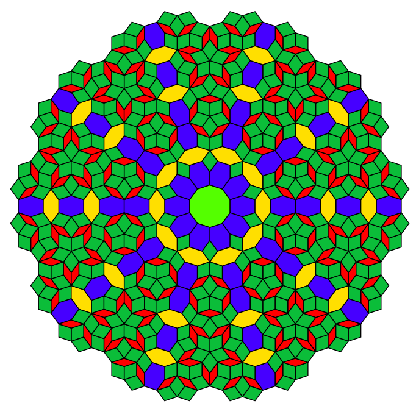

# Quasiperiodic Mosaics Generator

This Python script generates quasiperiodic mosaics using matplotlib for visualization.

## Requirements

Ensure you have the following Python packages installed:
- `numpy`
- `scipy`
- `matplotlib`


## Usage

Run the script directly with Python:

```bash
python mosaics.py
```

## Configurable Parameters

You can customize the behavior of the script by modifying the following parameters in the script:

- **`grid_shifts`**: A list of float values that determines the shifts in each grid direction. The length of this list also defines the dimensionality (number of grid vectors) used for generating the mosaics.

- **`grid_range`**: An integer that specifies the number of lines in each grid. Increasing this number will increase the density of the grid lines, thereby affecting the complexity and detail of the generated mosaic.

- **`plot_range_limit`**: An integer that sets the visible range of the plot on both the x and y axes. This defines how much of the generated mosaic is displayed in the plot.

- **`connected_tiles`**: A boolean (`True` or `False`). If set to `True`, only the connected parts of the mosaic are displayed. 

## Example


